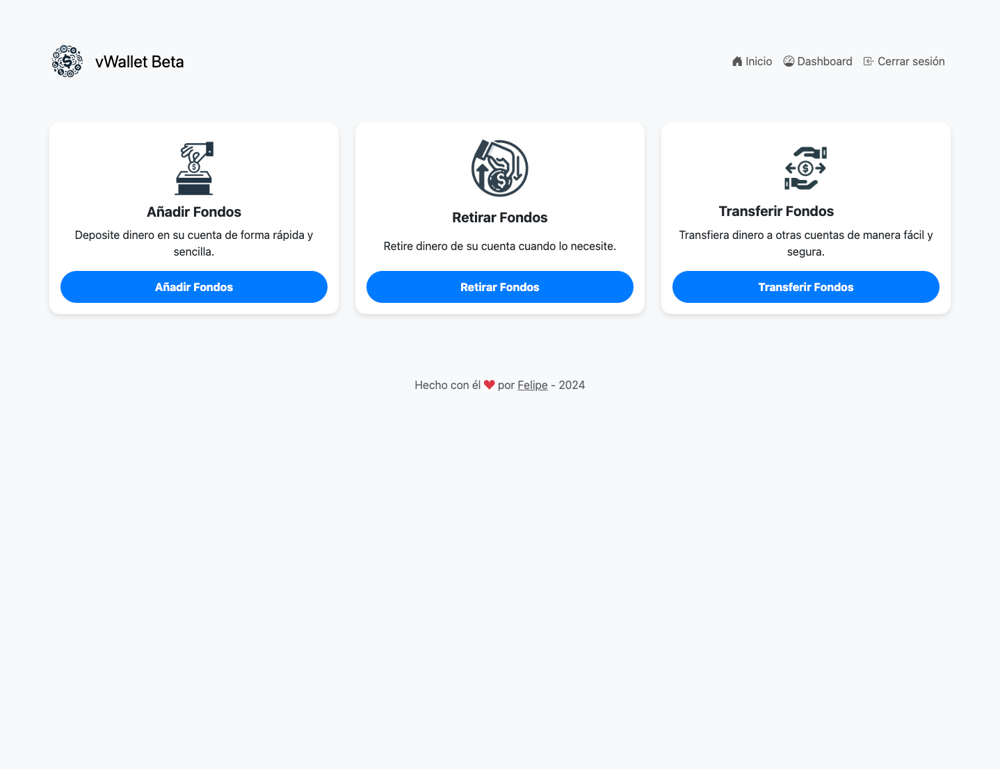
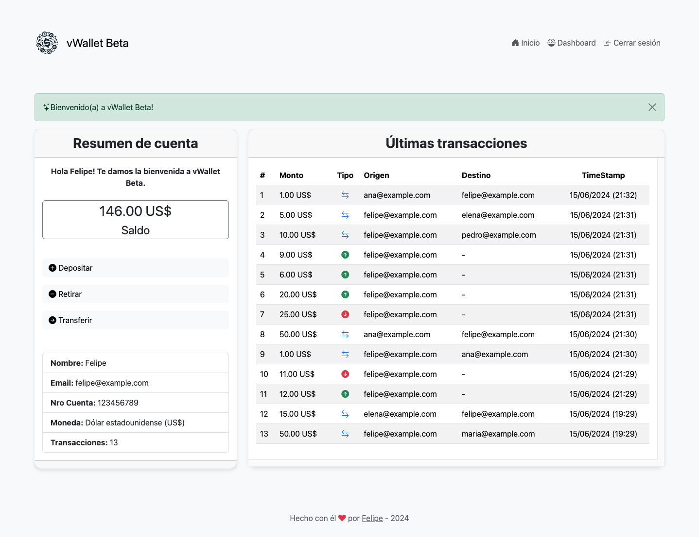

# 💰 vWallet Beta - Spring Boot 3.3.0

vWallet Beta es una aplicación web de banca personal desarrollada con Spring Boot 3.3.0. Permite a los usuarios realizar transacciones bancarias básicas como depósitos, retiros y transferencias.

## ✅ Características

- Inicio de sesión de usuarios
- Depósitos y retiros de dineros desde cuentas
- Transferencias entre cuentas
- Visualización del historial de transacciones

## 🖥️ Tecnologías utilizadas

- Java 17
- Spring Boot 3.3.0
- Spring Security
- Spring Data JPA
- Spring Web
- Bootstrap 5
- Thymeleaf
- MariaDB
- Maven

## ⚙️ Cómo ejecutar la aplicación

### 📋 Pre-requisitos
- Debe tener un servidor de base de datos MySQL o MariaDB en ejecución.
- Debe tener Java 17 instalado en su máquina.
- Debe tener Maven instalado en su máquina.
- Debe tener Git instalado en su máquina.

1. Clona el repositorio en tu máquina local usando `git clone https://github.com/felipejoq/vwallet.git`.
2. Navega al directorio del proyecto usando `cd vwallet`.
3. Ejecuta `mvn clean install` para construir el proyecto.
4. Ejecuta `mvn spring-boot:run` para iniciar la aplicación.
5. Abre un navegador web y visita `http://localhost:8080` para ver la aplicación.

### 👨‍💻 Configuración de la base de datos

El archivo SQL se encuentra en `src/main/resources/db.sql`. Puede importar este archivo en su servidor de base de datos para crear la base de datos y las tablas necesarias.

La aplicación utiliza MariaDB como base de datos. Puede cambiar la configuración de la base de datos en el archivo `application.properties` ubicado en `src/main/resources`.

```properties
spring.datasource.url=jdbc:mariadb://localhost:3306/vwallet
spring.datasource.username=root
spring.datasource.password=root
spring.datasource.driver-class-name=org.mariadb.jdbc.Driver
spring.jpa.hibernate.ddl-auto=validate
```
## ℹ️ Usuarios de prueba
| nombre | correo             | password |
|--------|--------------------|----------|
| felipe | felipe@example.com | 123123   |
| maria  | maria@example.com  | 123123   |
| pedro  | pedro@example.com  | 123123   |
| ana    | ana@example.com    | 123123   |
| elena  | elena@example.com  | 123123   |


## Capturas de pantalla


